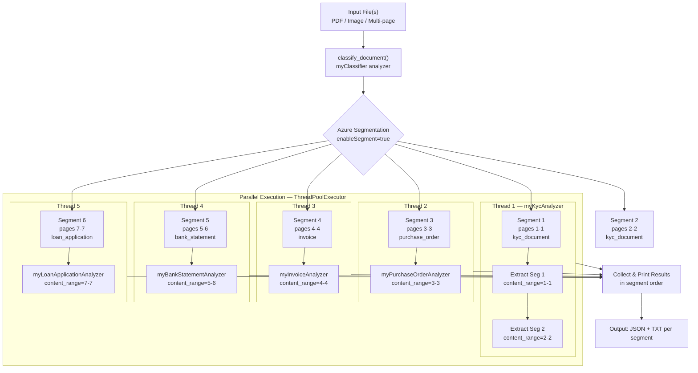

# Document Classification & Routing Pipeline — Technical Architecture

> **File**: [02_classify_and_route.py](file:///c:/Users/703453967/Downloads/cu_poc_studio/ContentUnderstanding/scripts/02_classify_and_route.py)  
> **Date**: April 2026  
> **Status**: Production-ready PoC

---

## 1. Executive Summary

`02_classify_and_route.py` is an intelligent document processing pipeline built on the **Azure AI Content Understanding SDK**. It takes multi-document files (e.g., a loan bundle PDF containing KYC, invoices, bank statements, and applications) and automatically:

1. **Segments** the file into logical document boundaries using Azure's built-in segmentation
2. **Classifies** each segment into a document category
3. **Routes** each segment to a specialized field extractor
4. **Extracts** structured fields with confidence scores
5. **Outputs** results in both human-readable tables and machine-readable JSON

All of this happens in a single script invocation with **parallel execution** to maximise throughput.

---

## 2. Pipeline Architecture



---

## 3. Key Design Decisions

### 3.1 Page-Level Routing via `content_range`

> [!IMPORTANT]
> This was a critical bug fix. Previously, the **entire file** was sent to every analyzer regardless of segment boundaries.

When the classifier identifies segments (e.g., pages 1–1 = KYC, pages 3–3 = Purchase Order), the extraction phase uses the Azure SDK's `content_range` parameter to send **only the relevant pages** to each analyzer:

```python
poller = client.begin_analyze_binary(
    analyzer_id, 
    binary_input=file_content, 
    content_range="3-3"  # Only page 3
)
```

**Why this matters:**
- **Accuracy** — Each analyzer processes only its intended content, avoiding confusion from unrelated pages
- **Cost** — Azure charges are based on pages processed; sending the full file multiplied the cost by N segments
- **Correctness** — Without page filtering, a KYC analyzer running on a 7-page bundle would try to extract KYC fields from invoice pages, producing garbage results

### 3.2 Parallel-by-Analyzer, Serial-within-Group

The extraction phase uses a **hybrid parallelism** model:

| Scenario | Execution | Reason |
|----------|-----------|--------|
| Segments using **different** analyzers | **Parallel** (separate threads) | No shared state, independent API endpoints |
| Segments using the **same** analyzer | **Serial** (within one thread) | Avoids race conditions and potential API rate limiting on a single analyzer |

**Implementation:** Segments are grouped by `analyzer_id` using a `defaultdict`. Each group is submitted as a task to `ThreadPoolExecutor`. The thread processes its segments sequentially.

```
Thread 1: myKycAnalyzer       → Seg 1 → Seg 2  (serial)
Thread 2: myPurchaseOrderAnalyzer → Seg 3
Thread 3: myInvoiceAnalyzer      → Seg 4        (all in parallel)
Thread 4: myBankStatementAnalyzer → Seg 5
Thread 5: myLoanApplicationAnalyzer → Seg 6
```

### 3.3 Deferred Output (No Garbled Console)

All extraction threads run silently — **zero `print()` calls from threads**. Results are stored in a shared `results` dictionary keyed by segment index. After all threads complete, the main thread prints everything in segment order.

**Why:** Multi-threaded `print()` calls interleave unpredictably, producing garbled terminal output (a problem we directly encountered and fixed).

### 3.4 Virtual Segments for Multi-Category Pages

When a single page contains multiple document types (e.g., an image with both a PAN card and an Aadhaar card), Azure's page-based segmentation might only assign one category. The classifier uses a custom `multiple_categories_found` field to detect additional categories and creates **virtual segments** that still route to the correct analyzer:

```python
segments.append({
    "category": "aadhaar_card",
    "startPageNumber": 1,
    "endPageNumber": 1,
    "_virtual": True  # Not from Azure segmentation, added by our logic
})
```

### 3.5 Single File Read, Shared Across Threads

The file is read into memory **once** as `bytes`. Since Python `bytes` objects are **immutable and thread-safe**, all threads share the same reference without needing locks or copies.

```python
with open(file_path, "rb") as f:
    file_content = f.read()  # Read once, shared across all threads
```

### 3.6 SDK Model Unwrapping (`to_dict`)

Azure SDK models are complex object graphs with internal `_data` wrappers and non-serializable bindings. The `to_dict()` function recursively converts these into clean Python dictionaries:

- Strips `_data` wrappers from SDK internals
- Handles both `dict` and list structures
- Falls back to `json.dumps` → `json.loads` loop for stubborn SDK objects
- Ensures all downstream code works with plain dicts, not SDK-specific types

---

## 4. Performance

### 4.1 Benchmarks (7-page Document.pdf, 6 segments, 5 unique analyzers)

| Metric | Serial (old) | Parallel (current) | Improvement |
|--------|:------------:|:-------------------:|:-----------:|
| Total runtime | ~141s | ~46s | **~3× faster** |
| Classification phase | ~10s | ~10s | Same (single call) |
| Extraction phase | ~130s | ~35s | **~3.7× faster** |

### 4.2 Timing Breakdown

The script reports three timing levels:

```
Classification completed in 10.2s       ← classifier API call
All extractions completed in 35.4s      ← parallel extraction phase only
All files processed in 45.92 seconds.   ← end-to-end including I/O & printing
```

The gap between `(classification + extraction)` and total tells you the overhead of file I/O, JSON serialization, and console output.

### 4.3 Scaling Characteristics

| Factor | Impact |
|--------|--------|
| More **unique** document types in a file | More parallel threads → better speedup |
| More segments of the **same** type | Serial within group → linear increase for that group |
| Larger page count per segment | Depends on Azure API processing time per page |
| Multiple input files | Currently processed sequentially (per-file loop) |

---

## 5. Category-Analyzer Registry

The `CATEGORY_ANALYZER_MAP` is the central routing table. Adding a new document type requires two steps:

1. Create the analyzer config JSON in `analyzers/` and deploy it via `01_setup_analyzers.py`
2. Add a single line to the map:

```python
CATEGORY_ANALYZER_MAP = {
    "loan_application": "myLoanApplicationAnalyzer",
    "invoice":          "myInvoiceAnalyzer",
    "contract":         "myContractAnalyzer",
    "purchase_order":   "myPurchaseOrderAnalyzer",
    "kyc_document":     "myKycAnalyzer",
    "medical_report":   "myMedicalReportAnalyzer",
    "bank_statement":   "myBankStatementAnalyzer",
    # "new_doc_type":   "myNewDocTypeAnalyzer",   ← just add here
}
```

> [!NOTE]
> **Naming convention**: Analyzer IDs use camelCase (e.g., `myKycAnalyzer`). Category names from the classifier use snake_case (e.g., `kyc_document`). This is enforced by Azure's requirements.

---

## 6. Data Flow & Output Structure

### 6.1 Per File — Output Files Generated

For an input file `Document.pdf` with 6 segments:

```
output/
├── Document_classification.json              ← Full classifier response
├── Document_segment1_kyc_document_result.json      ← Segment 1 extraction (JSON)
├── Document_segment1_kyc_document_fields.txt       ← Segment 1 fields (human-readable)
├── Document_segment2_kyc_document_result.json
├── Document_segment2_kyc_document_fields.txt
├── Document_segment3_purchase_order_result.json
├── Document_segment3_purchase_order_fields.txt
├── Document_segment4_invoice_result.json
├── Document_segment4_invoice_fields.txt
├── Document_segment5_bank_statement_result.json
├── Document_segment5_bank_statement_fields.txt
├── Document_segment6_loan_application_result.json
├── Document_segment6_loan_application_fields.txt
├── Document_all_segments_result.json         ← Combined result for all segments
└── combined_results.json                     ← Only if multiple files processed
```

### 6.2 Extracted Field Schema

Each field includes:

| Property | Description |
|----------|-------------|
| `name` | Hierarchical field name (e.g., `transactionHistory[3].balance`) |
| `value` | Extracted value as string |
| `type` | Field type: `string`, `number`, `date`, `boolean`, `array`, `object` |
| `confidence` | Azure AI confidence score (0.0 – 1.0) |

### 6.3 Nested Field Flattening

Complex schemas (arrays of objects) are recursively flattened into a readable format:

```
kycDocuments[1].documentType   : Driving License (0.452)
kycDocuments[1].fullName       : UPENDRA KUMAR MISHRA (0.641)
kycDocuments[2].documentType   : Voter ID (0.664)
kycDocuments[2].fullName       : FARDEEN ABBASI (0.459)
```

This preserves the document order and retains per-field confidence scores that would be lost with naive JSON flattening.

---

## 7. Input Flexibility

The script supports multiple input modes via a single interactive prompt:

| Input | Behavior |
|-------|----------|
| `data/sample.pdf` | Single file |
| `data/doc1.pdf, data/doc2.pdf` | Comma-separated multiple files |
| `data/` | Entire directory — auto-discovers PDF, PNG, JPG, JPEG, TIFF, BMP files |
| Mixed | `data/doc1.pdf, data/folder/` — combination of files and folders |

---

## 8. Project Structure

```
ContentUnderstanding/
├── .env                          # Azure credentials (AZURE_AI_ENDPOINT, AZURE_AI_API_KEY)
├── analyzers/                    # Analyzer config JSONs (deployed via 01_setup_analyzers.py)
│   ├── classifier_analyzer.json
│   ├── kyc_analyzer.json
│   ├── invoice_analyzer.json
│   ├── bank_statement_analyzer.json
│   ├── loan_application_analyzer.json
│   ├── purchase_order_analyzer.json
│   ├── contract_analyzer.json
│   └── medical_report_analyzer.json
├── scripts/
│   ├── 01_setup_analyzers.py     # Deploy/update analyzers to Azure
│   ├── 02_classify_and_route.py  # ★ Main pipeline (this doc)
│   └── 04_manage_analyzers.py    # List/delete analyzers
├── data/                         # Input documents
├── output/                       # Generated results (JSON + TXT)
└── requirements.txt              # Python dependencies
```

---

## 9. Dependencies

| Package | Purpose |
|---------|---------|
| `azure-ai-contentunderstanding` | Azure AI Content Understanding Python SDK |
| `azure-core` | Azure authentication (`AzureKeyCredential`) |
| `python-dotenv` | Load credentials from `.env` |
| Python stdlib: `concurrent.futures` | Thread-based parallelism |
| Python stdlib: `collections.defaultdict` | Segment grouping |

---

## 10. Error Handling & Resilience

| Scenario | Handling |
|----------|----------|
| File not found | Prints `[FAIL]`, returns empty dict, continues to next file |
| Unmapped category | Prints `[WARN]`, skips extraction, records in output JSON |
| Thread exception | Re-raised on main thread via `future.result()` |
| No segments found | Prints `[WARN]`, skips extraction |
| Empty/missing field values | Displays `(not found)` with confidence score |

---

## 11. Future Enhancement Opportunities

| Enhancement | Effort | Impact |
|-------------|--------|--------|
| **Async SDK** (`azure.ai.contentunderstanding.aio`) | Medium | Replace threads with `asyncio` for true non-blocking I/O |
| **Per-file parallelism** | Low | Wrap the file loop in ThreadPoolExecutor for multi-file scenarios |
| **Retry with backoff** | Low | Handle transient Azure API failures gracefully |
| **Confidence threshold filtering** | Low | Flag or reject extractions below a configurable confidence |
| **Webhook/API mode** | Medium | Replace interactive CLI with Flask/FastAPI endpoint |
| **Result caching** | Medium | Skip re-extraction for previously processed files (hash-based) |

---

## 12. Summary

This pipeline demonstrates a **production-grade pattern** for intelligent document processing:

- **Single entry point** handles any document mix
- **Automatic segmentation** eliminates manual page splitting
- **Smart routing** sends each segment to the right specialist
- **Parallel execution** delivers ~3× throughput improvement
- **Clean output** in both machine (JSON) and human (TXT) formats
- **Extensible** — new document types require only a single line of configuration
